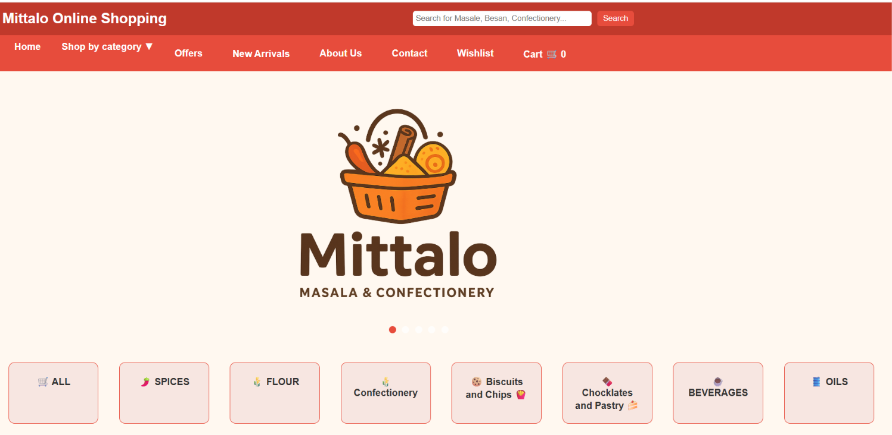
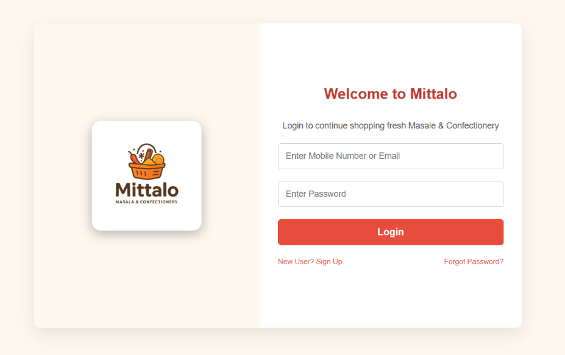
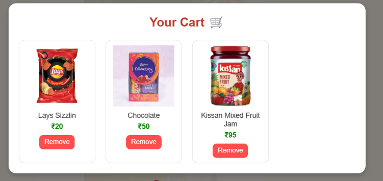

# 🛒 Mittalo – Online Shopping Website

Mittalo is a responsive online shopping website developed using **HTML, CSS, and JavaScript**.  
The website provides a user-friendly interface for browsing products, searching items, filtering categories, and managing a shopping cart.

## 🚀 Features

- 🏠 Responsive Home Page
- 🔍 Product Search
- 📂 Category Filtering
- 🛍️ Product Details
- 🛒 Shopping Cart
- ❤️ Wishlist
- 🔐 User Login
- 🎁 Offers & New Arrivals
- 📱 Responsive Web Design
- 🛒 Multiple Product Categories

## 📦 Product Categories

- 🌶️ Spices
- 🌾 Flour & Besan
- 🍿 Snacks
- 🍬 Confectionery
- 🥤 Beverages
- 🥫 Ready-to-Cook Products
- 🛒 Grocery

## 🛠️ Technologies Used

- HTML5
- CSS3
- JavaScript
- Git & GitHub

## 📸 Screenshots

### 🏠 Home Page



### 🛍️ Products Page


### 🔐 Login Page



### 🛒 Shopping Cart



## 📁 Project Structure

```text
Mittalo/
│
├── index.html
├── login.html
├── style.css
├── script.js
│
├── images/
│   ├── home.png
│   ├── products.png
│   ├── login.png
│   └── cart.png

💻 How to Run
1. Download or clone this repository.
2. Open the project folder.
3. Open index.html in any web browser.
4. Explore the Mittalo online shopping website.
🎯 Project Objective
The main objective of this project is to develop a simple, responsive, and user-friendly e-commerce website that demonstrates practical knowledge of HTML, CSS, and JavaScript.

👨‍💻 Developer
 Vibhu Mittal
 B.Tech – Computer Science & Engineering
